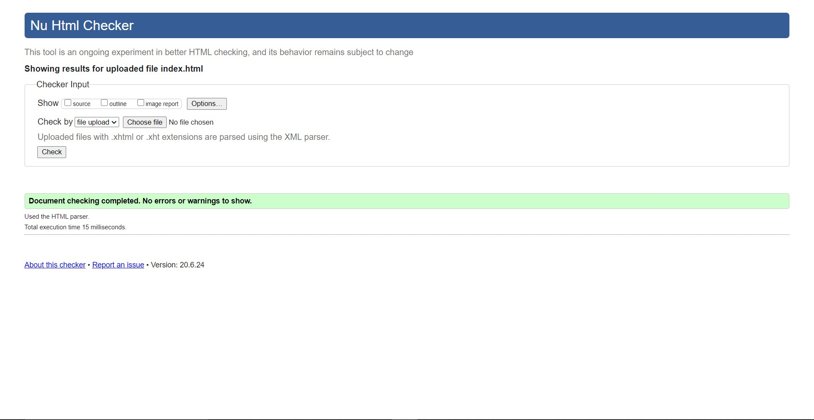
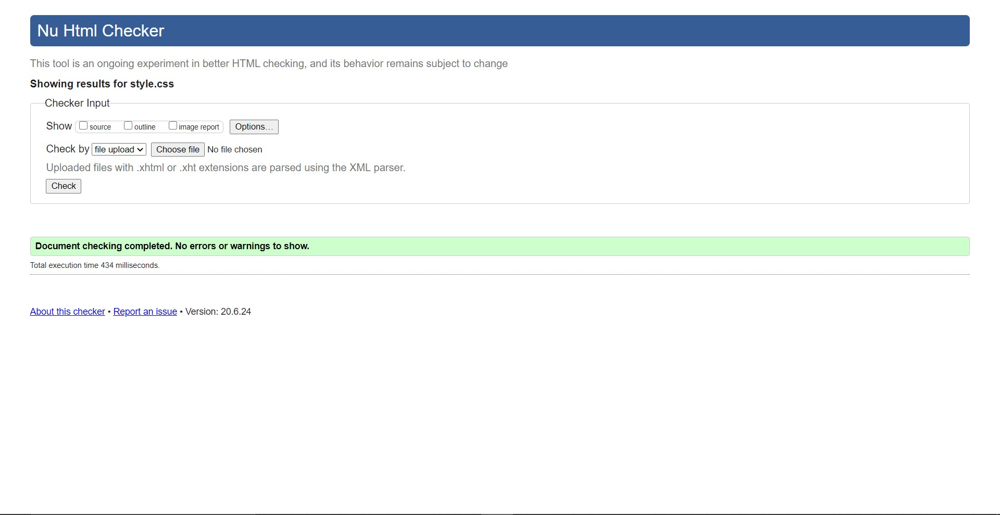
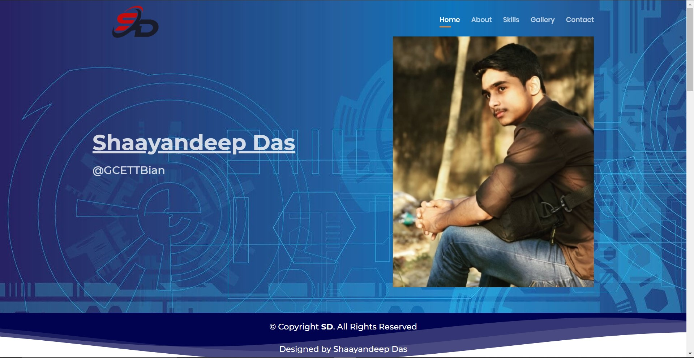
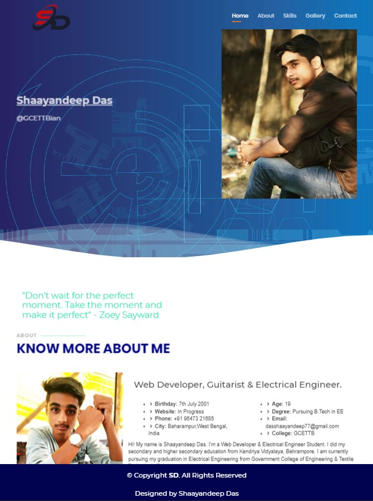
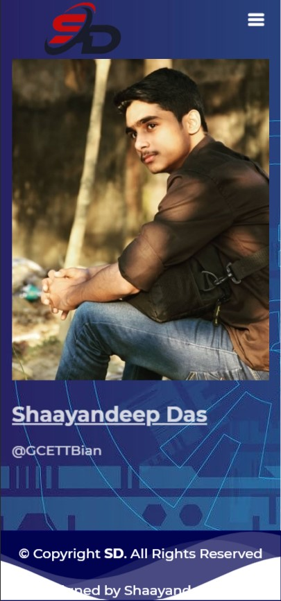

# Site is published at http://www.shaayan-77.github.io
Please make sure to visit the site.

Site designed by *Shaayandeep Das* with the help of template.

Template Name: Bootslander
Template URL: https://bootstrapmade.com/bootslander-free-bootstrap-landing-page-template/
Author: BootstrapMade.com
License: https://bootstrapmade.com/license/

# The portfolio site is completed as per Coursera guidlines.

# 1. w3 validator compliant (No errors or warnings)

# 2. Responsive site (The site has a unique look/layout for each of the views)
For Desktop Mode - 
For Tablet Mode - 
For Smartphone Mode - 

# 3. Well-styled (CSS files are included)
Main CSS File - (assets/css/style.css)

# Demonstrating my four "extras":

1. Bootstrap Carousel - Refer to line 236 in index.html
2. Embedded Google Calender - Refer to line 337 in index.html
3. Sticky Footer - Refer to line 349 in index.html
4. Font Awesome - Refer to line 